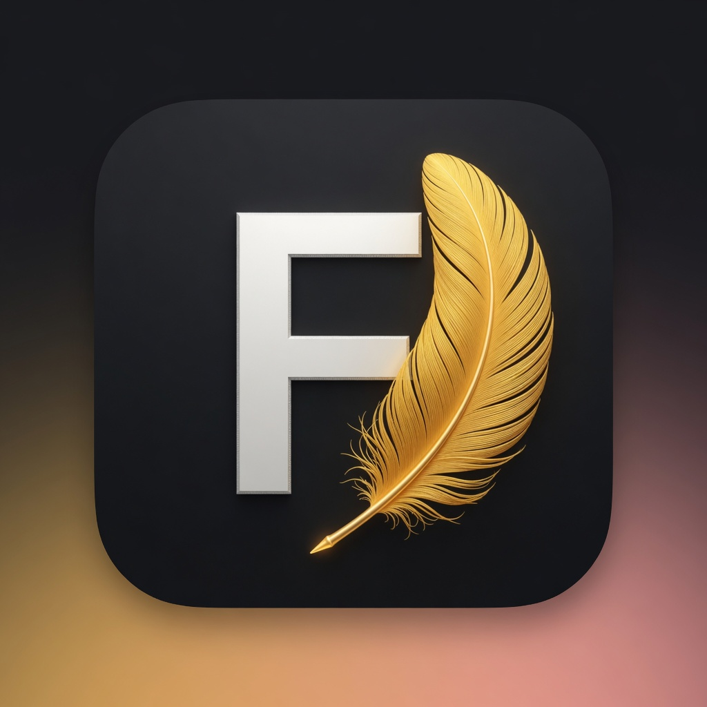
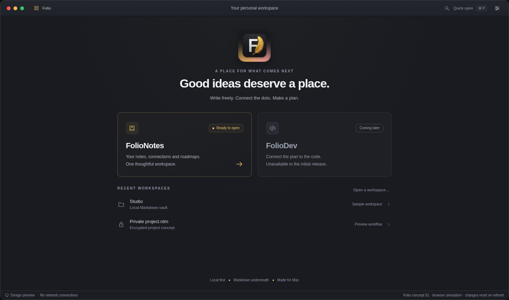
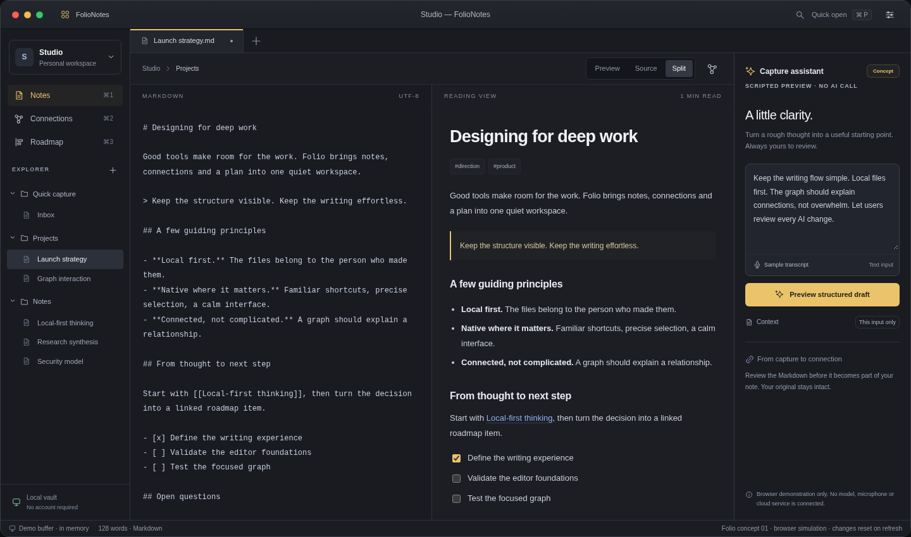
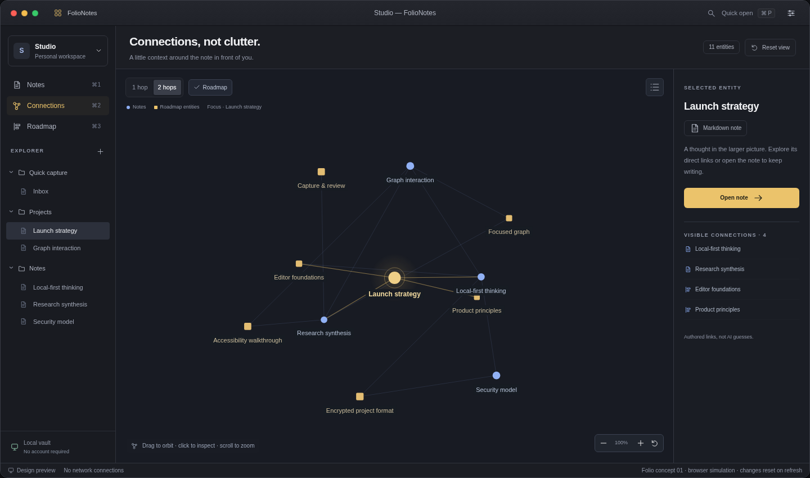
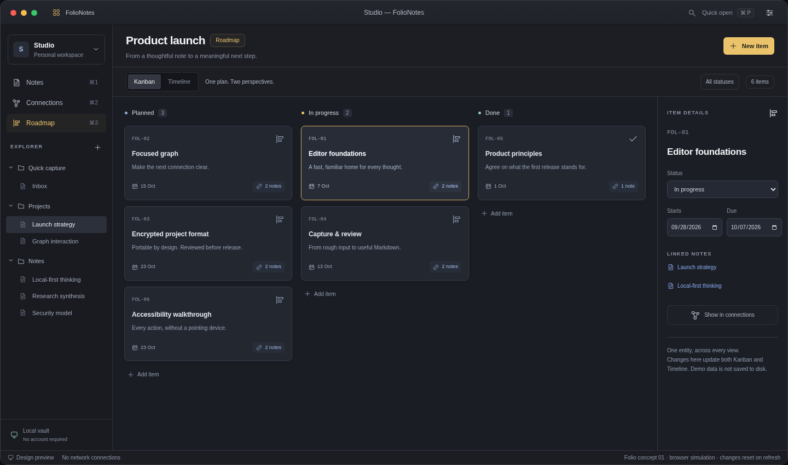
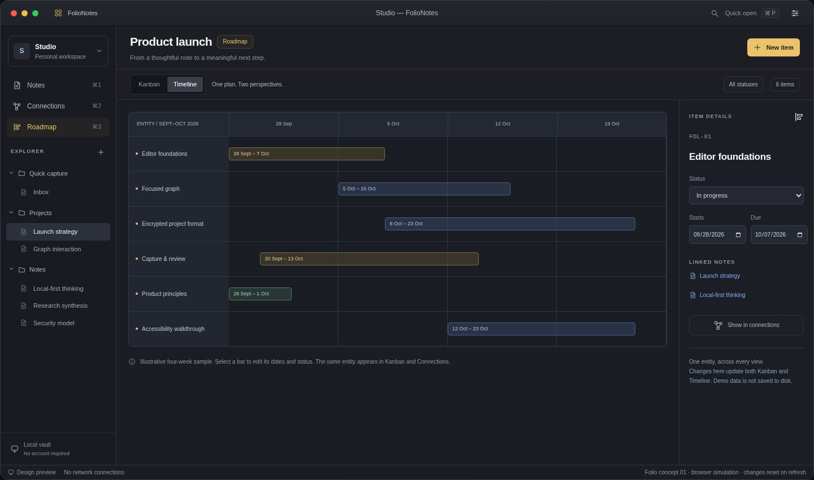
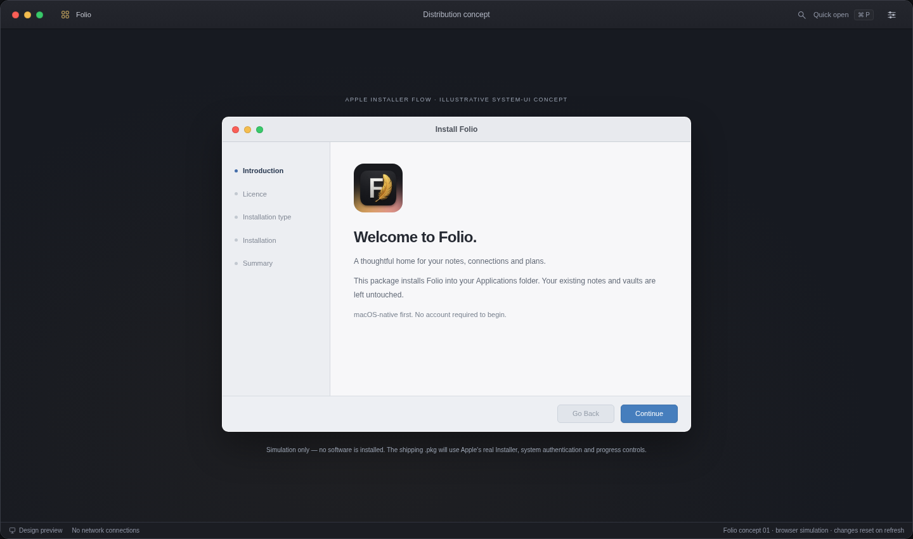
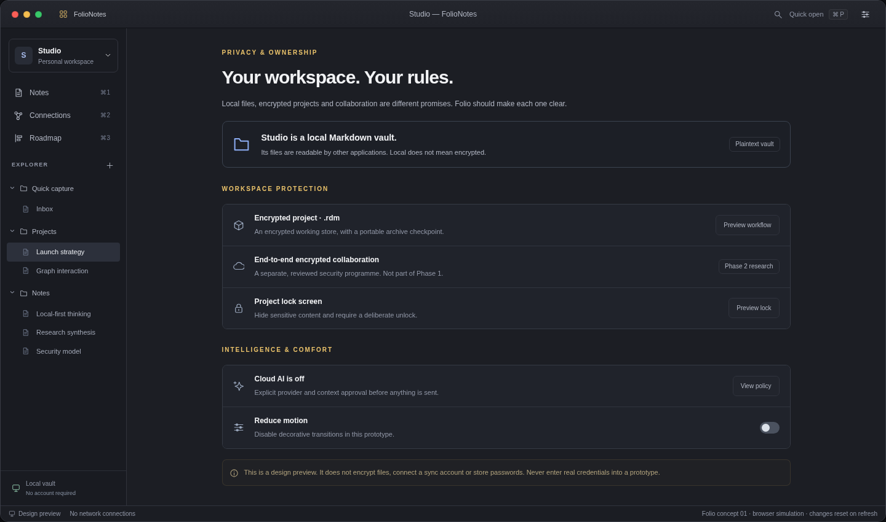

# Folio
## Product & engineering baseline

**Native first. Portable by design. Private by default.**

Version 1.0 · 27 September 2026 · Planning horizon: Q4 2026–Q3 2030  
Status: proposed engineering baseline, not a claim of implemented or benchmarked software.



The supplied logo is the approved identity and is preserved byte-for-byte. It supersedes earlier colour and composition directions. No logo redesign is included in this package. Production icon sizes and platform-specific masks require a separate export pass from an approved source asset; the supplied image remains untouched.

---

# 01 / Executive decisions

Folio is one desktop application with two modules. **FolioNotes ships first. FolioDev is visible on the right of the launcher but greyed out, disabled and non-clickable throughout the initial production phases.** Notes, plans and, later, source references share stable entity identities rather than becoming three disconnected products.

The product promise is not “another everything app”. It is a dependable path from **capture → understand → connect → plan → build**, without giving up ownership of the underlying material.

| Area | Baseline decision | Reason / consequence |
|---|---|---|
| macOS shell | Swift + SwiftUI; AppKit integration where precision matters | Native windowing, menus, accessibility and platform behaviour without an embedded web application |
| Editor | AppKit `NSTextView` / TextKit 2 behind a narrow SwiftUI bridge | Native text input, undo, selection, IME and viewport-based layout; validate the difficult cases before committing |
| Graph | Metal / MetalKit, bounded local neighbourhood first | Direct control over drawing, memory, level of detail and idle power; not SceneKit or an always-running physics demo |
| Vault | Plain UTF-8 Markdown plus portable metadata | Users can leave, back up, use Git and edit outside Folio |
| Index | Rebuildable local SQLite + FTS5 | Fast relational traversal and full-text search; never the only copy of authored material |
| Encrypted projects | `.rdm` encrypted single-file archive plus an encrypted working store | Portable checkpoints without rewriting a large archive for every keystroke |
| AI | Optional on-device broker first; explicit cloud opt-in later | Writing and planning never depend on model availability or a cloud account |
| Collaboration | Separate Phase 2 security programme: CRDT + evaluated MLS implementation | E2EE is not implied by TLS or archive encryption; no Phase 1 real-time collaboration claim |
| Distribution | Developer ID-signed, notarized, stapled `.pkg` | Professional Apple Installer experience with versioned payloads; no custom privileged installer |
| Windows | Phase 3: Rust domain core + Tauri 2 presentation, gated by parity tests | Share data and behaviour, not the Mac view hierarchy; native Windows shell alternative if the prototype fails |
| Android | Phase 4: Kotlin / Jetpack Compose, read-only first | Small, dependable vault companion; controlled light editing only after recovery and sync gates |

**Non-negotiable product constraints**

- Phases 1–2 are deeply optimised for macOS. A web prototype in this package is a design communication tool, not a proposal to replace the Mac shell with web technology.
- No account is required to create, read, search or edit a local vault.
- Existing Markdown is not silently reformatted, uploaded, encrypted or migrated.
- One roadmap entity has one identity across Timeline, Kanban, graph and linked notes.
- FolioDev has no hidden activation route, keyboard shortcut or click target in the initial production launcher.
- A plain local vault is **not** described as encrypted. E2EE protects transport between participants, not plaintext files already on an endpoint.
- A successful save, an index update, an archive checkpoint and a remote acknowledgement are separate states in both implementation and UI.
- All numbers below are **proposed targets** to validate on hardware, not measured results.

**Planning assumptions to ratify**

Minimum macOS 26; Apple Silicon is the initial supported hardware baseline, with an M1 / 8 GB Mac as the performance floor. No speculative dependency on a future OS release is required. Intel support is excluded from the initial estimate and would need its own compatibility budget. Use the latest stable toolchain available at implementation time while testing the minimum supported OS. Distribution starts outside the Mac App Store. Phase 1 does not include arbitrary plug-ins, executable Markdown, a browser, a terminal, a debugger or a public extension marketplace.

---

# 02 / Multi-year delivery roadmap

The four phases are **gated delivery envelopes**, not unconditional calendar promises. Relative month 0 is the start of a funded team; the dates assume October 2026. Keep at least 20% of each phase for hardening, accessibility and unplanned platform work. If a gate fails, reduce scope or extend the phase rather than quietly lowering the durability or privacy standard.

## Phase 1 · The dependable Mac foundation

**Months 0–11 · Q4 2026–Q3 2027 · FolioNotes 1.0**

| Window | Priority and deliverables | Evidence required to exit |
|---|---|---|
| M0–1 | P0: editor / IME spike, filesystem journal prototype, 10k / 100k vault fixtures, threat model, `.rdm` envelope draft, visual tokens | Demonstrated round-trip fidelity, crash recovery and bounded viewport work; architecture decisions reviewed |
| M2–4 | P0: native launcher, file explorer, tabs / split editing, Markdown source + preview, links, backreferences, search, import and export | Ordinary vault remains usable in other tools; all acknowledged saves survive the fault-injection suite |
| M5–7 | P0: Kanban and basic Timeline on a common entity model; focused 3D graph; `.rdm` checkpoint / recovery; P1: scripted-to-model capture integration | Roadmap changes round-trip across views; graph stays bounded; archive vectors interoperate and reject tampering |
| M8–9 | P0: signed installer, migration safety, VoiceOver, keyboard flows, recovery UX; P1: on-device structured capture and speech where available | Clean-machine install / upgrade tests; independent review of encrypted storage; unsupported AI paths remain fully usable |
| M10–11 | Beta → release candidate → GA | 30-day beta quality window, zero open data-loss defects, no known critical/high security defects, performance budgets met |

**Ships:** local Markdown PKM, split editor, file explorer, local graph, Timeline + Kanban, encrypted `.rdm` portability, review-before-apply AI, professional installer. **Does not ship:** real-time multi-user collaboration, Windows / Android clients, FolioDev activation or a full scheduling engine.

If encryption review is not complete, ship the plain-vault release with `.rdm` clearly marked preview or hold that feature; never label an unaudited preview as security-approved. The roadmap assumes a reviewed `.rdm` implementation for the full Phase 1 scope.

## Phase 2 · Native depth and trusted collaboration

**Months 12–23 · Q4 2027–Q3 2028 · macOS remains the product focus**

- M12–15: optimise 100k-note behaviour, long-document handling, multi-window sessions, graph clustering and low-power modes. Improve date editing and dependency visualisation; add Gantt only after the shared entity model proves stable.
- M14–18: freeze `.rdm` v1 conformance vectors; extract platform-neutral parsing, identities, roadmap validation and package logic into Rust behind stable APIs. Preserve the native Mac editor and Metal renderer. Run Swift-versus-Rust differential tests before switching ownership.
- M16–20: invite-only E2EE collaboration alpha for small groups. Select a maintained CRDT and MLS implementation, validate their licences and audit history, test offline edits and membership changes, commission an independent protocol-integration review.
- M21–23: limited collaboration beta only after revocation, recovery, checkpointing and adversarial network tests pass. Public GA is a distinct approval, not implied by “Phase 2 complete”.
- FolioDev stays disabled in production. An isolated internal build may test roadmap-to-source links and a native code pane, without promising a full IDE or exposing development tools in the Notes release.

**Exit:** native quality and data durability are unchanged by shared-core extraction; audited collaboration evidence supports the intended beta scope; Windows can consume a stable format and API without owning the Mac interface.

## Phase 3 · Windows parity, then the build workflow

**Months 24–35 · Q4 2028–Q3 2029**

- M24–26: vertical slice in Tauri 2 + Rust; native dialogs, accessibility, IME, multiple windows, file watchers, encrypted storage and graph rendering. Compare against a WinUI 3/native-shell fallback, using the same fixtures and interaction scripts.
- M27–30: Windows FolioNotes parity: local vaults, `.rdm`, editor, links, roadmaps, search and the collaboration status supported by the Mac release. Test NTFS semantics, case collisions, Unicode filenames, DPI changes and sleep / resume.
- M31–33: signed Windows packaging and update rollback; dual-platform beta; operational support and incident playbooks.
- M34–35: release Windows parity. Only after that gate, activate an **opt-in FolioDev preview on Mac and Windows together**: source linking, repository-aware navigation, a code-editing pane and a narrow LSP integration. Leave terminal execution and debugging out until separately threat-modelled.

Parity means compatible files, recovery semantics, core workflows and accessibility, not pixel-identical title bars or pretending a webview is a native Mac text editor. If Tauri cannot pass text-input or accessibility gates, keep the shared core and switch the Windows shell; do not rewrite the Mac app in the selected cross-platform toolkit.

## Phase 4 · Android vault companion

**Months 36–47 · Q4 2029–Q3 2030**

- M36–39: native Kotlin / Compose read-only preview: unlock, browse, local search, read Markdown, inspect roadmap entities, lightweight 2D connections and encrypted offline cache.
- M40–43: optional light edit alpha: capture to Inbox, append to a note, toggle an owned task. No full desktop layout, integrated IDE or unbounded 3D graph.
- M44–47: improve conflict / reconnect flows, background sync within OS constraints, device revocation, export and low-memory recovery. Expand editing only if it does not compromise read-only reliability.

**Exit:** use is safe offline, a killed process cannot lose acknowledged edits, revoked devices are handled honestly, and an older Android client never writes a schema it cannot preserve.

## Staffing and sequencing

A plausible starting envelope is **8–10 full-time equivalents**: one technical lead, three native / editor engineers, one storage / security engineer, one graphics / performance engineer, one product designer, one automation / quality engineer, plus fractional product and security-review capacity. Expand platform-specific teams before Phase 3 rather than pulling the entire native team onto a port. This is a sizing assumption, not a cost estimate.

The critical path is **editor + recovery → stable identities → roadmap / graph projections → `.rdm` review → portable core → E2EE integration → Windows parity → Android editing**. Visual polish can run in parallel; key management, data formats and recovery cannot be bolted on after collaboration.

## Prioritisation rules

- **P0:** data integrity, privacy boundaries, native writing loop, essential navigation, accessible equivalents, import / export and install / update safety.
- **P1:** high-value depth once the P0 path is dependable: intelligent capture, advanced graph filters, richer planning, collaborative presence.
- **P2:** convenience and ecosystem breadth: plug-ins, elaborate themes, extensive IDE tools and automation.
- A P1 feature cannot consume the budget reserved for a failed P0 gate. Do not use animation quality to offset failed accessibility, or search throughput to offset lost edits.

---

# 03 / Technical architecture

## 3.1 Native boundaries

```text
SwiftUI scenes, commands, preferences, inspector and navigation
  ├─ AppKit editor island: NSTextView / TextKit 2 / NSUndoManager
  ├─ AppKit file/navigation integration and native panels
  └─ MetalKit graph surface with accessible companion list
                 ↓ typed commands / immutable view snapshots
Application services: WorkspaceCoordinator, CommandRouter, SelectionContext
  ├─ DocumentStore actor        ├─ RoadmapService
  ├─ IndexCoordinator           ├─ GraphProjection / LayoutWorker
  ├─ PackageService / KeyBroker ├─ AIJobBroker / SpeechAdapter
  └─ SyncEngine (Phase 2+)      └─ SourceLinkService (later)
                 ↓ storage and platform adapters
Markdown + portable metadata | encrypted object store | local index
FSEvents / file coordination | Keychain / CryptoKit | network broker
```

SwiftUI owns the shell, not every hot path. Use small stable observable models, identity-keyed lists and diffed snapshots. AppKit owns responder-chain behaviour, text composition, native contextual menus and high-density editor interactions. Keep editor layout, graph rendering and model inference off broad SwiftUI state invalidations.

TextKit 2 provides viewport-oriented layout; crossing into legacy layout-manager APIs can trigger compatibility behaviour. Isolate the adapter and test this explicitly rather than accidentally mixing both engines. [2](https://developer.apple.com/videos/play/wwdc2021/10061/) [4](https://developer.apple.com/videos/play/wwdc2022/10090/)

**Rejected for the Mac core:** Catalyst imposes an unnecessary iPad-first abstraction; a full webview shell changes the native editing and accessibility problem; Flutter adds another UI runtime without preserving Mac-specific text behaviour. None is intrinsically unusable, but none is the default for this product's first two phases.

## 3.2 Concurrency and ownership

- A workspace coordinator owns workspace lifetime and capabilities, not mutable note text itself.
- The editor keeps an immediate local buffer; a per-document sequencer owns its ordered edits, revision and durable-save acknowledgement. Do not route every keystroke through the main actor and a database transaction.
- Storage, parsing, indexing, archive construction, layout and AI jobs use bounded queues. One SQLite writer per workspace; short read transactions and snapshot results.
- Never hold a document actor while awaiting a model, network request or long graph layout. Carry a base revision and cancel stale work. Avoid retaining SwiftUI views in background tasks.
- Work has priority and cancellation: typing / explicit save first, visible search second, indexing third, optional AI / clustering / compaction last. Pause optional work when hidden, low-power or thermally constrained.
- Coalesce filesystem events and compare content fingerprints. FSEvents is an invalidation signal, not an infallible audit log; resume / dropped-event conditions trigger a bounded reconciliation scan.

## 3.3 Module boundaries and shared-core evolution

Phase 1 Swift packages: `FolioDomain`, `FolioDocuments`, `FolioIndex`, `FolioRoadmaps`, `FolioGraph`, `FolioPackages`, `FolioAI`, `FolioMacUI`. Domain packages do not import SwiftUI or AppKit. Package, schema and command conformance fixtures are language-neutral from day one.

Phase 2 portable core: Rust owns schema validation, archive parsing, canonical IDs, CRDT integration and selected graph / roadmap algorithms. Swift adapters continue to own Apple APIs and views. Use a narrow versioned C ABI or generated bindings after a spike; explicit ownership, cancellation, bounded buffers and typed errors are required. Do not pass raw Swift or Rust pointers into another runtime's asynchronous callbacks without a lifetime contract. Move one subsystem at a time and compare outputs on the golden corpus.

**Service contract sketch**

```text
openWorkspace(handle, accessMode) -> WorkspaceSnapshot
applyDocumentEdit(noteID, baseRevision, transaction) -> LocalCommit
search(query, cursor, scope, cancellation) -> SearchPage
updateRoadmap(entityID, baseRevision, validatedPatch) -> LocalCommit
projectGraph(focusIDs, filters, nodeBudget) -> GraphSnapshot
checkpointPackage(workspaceID, destination, expectedRevision) -> Checkpoint
```

`LocalCommit` includes the new revision and durability state; it does not assert a cloud acknowledgement. UI input is validated again at the service boundary. Every operation has a stable error category, user-safe recovery action and trace ID that contains no note content.

---

# 04 / Data ownership and the Markdown contract

## 4.1 Two deliberate workspace modes

| Mode | Authoritative material | What is protected at rest | Interoperability |
|---|---|---|---|
| Plain vault | User-selected folder of Markdown, attachments and portable `.folio` metadata | Nothing automatically beyond the user's OS / disk security | External editors, Finder and Git can read it |
| Encrypted project | Encrypted application-managed working objects + authenticated manifest; `.rdm` is the portable checkpoint | Authored objects, metadata, history, journal and persistent index | Plaintext export is explicit and warns about the destination |

In encrypted mode, the **logical document representation remains UTF-8 Markdown**, but files are not left as plaintext on disk. This is an intentional interoperability / confidentiality trade-off. A user may export an ordinary vault, but Folio must not imply that plaintext export remains encrypted.

Example plain vault:

```text
Research/
  Inbox.md
  Projects/Launch plan.md
  Notes/Local-first.md
  Attachments/diagram.png
  .folio/
    workspace.json        # identity + format version; no secrets
    identities.json       # stable IDs for imported notes without front matter
    roadmaps/<uuid>.json   # authored roadmap entities and explicit links
    links.json            # authored typed links not expressible in Markdown
```

The rebuildable index, thumbnails, layout caches and machine-specific state live in the app's local support directory, not inside a folder that another tool may sync. An index directory is keyed by workspace identity plus local location identity; opening a copied vault detects a clone and asks whether to fork or relink it.

## 4.2 Notes, IDs and metadata

- New notes use UUIDs independent of their paths. Imported files are assigned stable IDs in the sidecar map unless the user elects to add front matter. A rename updates the path mapping, not the identity.
- Follow CommonMark plus explicitly documented extensions: fenced code, tables, task lists, front matter and wikilinks. Render unknown syntax safely as text. Version the extension profile.
- Preserve line endings and unknown front-matter fields where possible. Parser-to-printer is not an excuse to rewrite a vault. Invalid YAML is left intact with a warning, not silently “repaired”.
- Treat Markdown links as authored edges; backreferences and graph adjacency are derived. Explicit roadmap-to-note edges are authored metadata. AI-suggested links are proposals until accepted.
- Resolve `[[name]]` deterministically within scope; ambiguity opens a chooser. Persist the stable target ID alongside authored link intent when necessary. Broken links remain visible and repairable.
- An example new-note header is `folio_id`, `created`, `tags`, plus an optional `roadmap_ids` list. Dates use an explicit format; local wall-clock modification time is not a conflict-resolution clock.

## 4.3 Save, external edits and recovery

1. Editor transaction changes the in-memory buffer and immediately updates the view.
2. Within a proposed 250 ms coalescing window, persist a sequenced recovery journal. “Saving…” remains until the durability barrier succeeds.
3. For plain notes, write a sibling temporary file, flush, then atomically replace the destination on the same supported volume; coordinate access and preserve the expected permissions. Treat the directory-durability step explicitly in the platform adapter.
4. Publish the committed revision. Parsing and SQLite indexing follow asynchronously. If the index is stale, show that honestly without blocking writing.
5. On relaunch, replay verified journal entries and reconcile expected file fingerprints. Keep a recoverable previous version until the retention policy permits cleanup.

An edit still labelled “Saving…” can be lost in sudden power failure. The **zero-loss target applies to acknowledged durable saves** under the supported filesystem and fault model, not to all imaginable storage failures. A disk-full error keeps the buffer and recovery options visible; it never converts a failed save into a green check.

If an external editor changes a file with no unsaved local changes, reload with selection restoration. Otherwise perform a three-way comparison against the base revision; auto-merge only non-overlapping changes and present a conflict copy / comparison when intent is ambiguous. Do not overwrite either version silently. Pathological / malformed files open in a safe plain-text or read-only mode.

## 4.4 Index and search

Local SQLite tables model `notes`, `paths`, `links`, `tags`, `note_tags`, `roadmap_entities`, `entity_links` and a revision cursor. Add indices on stable IDs, normalised paths, incoming / outgoing link endpoints and roadmap state / date. Keep graph coordinates separate from authored data. Bulk work uses bounded batches, not one transaction per token.

FTS5 indexes title, body and selected metadata. Use external-content tables only with tested insert / update / delete synchronisation; SQLite explicitly makes consistency the application's responsibility. [1](https://www.sqlite.org/fts5.html)

Search defaults to safe literal terms, scoped filters and ranked snippets. Advanced syntax is opt-in. Escape or bind queries appropriately, cap result pages and offer cancellation. Start with Unicode-aware tokenisation and evaluate language-specific segmentation, CJK and accent behaviour using fixtures rather than claiming the default tokenizer solves every language.

The index is always local. SQLite WAL relies on same-host coordination and is not a shared network-filesystem database. Never sync an open WAL database as the vault's source of truth. [1](https://www.sqlite.org/wal.html)

Plain vault index: ordinary local SQLite, covered by the plain-vault privacy warning. Encrypted-project index: reviewed SQLCipher integration (including WAL / temporary-file configuration and key handling) or an in-memory index during the spike. Persistent plaintext FTS is prohibited in encrypted mode. Index corruption triggers a rebuild, not loss of authored roadmaps or notes.

---

# 05 / The `.rdm` format and encryption boundary

## 5.1 One portable representation

**Decision:** `.rdm` is a single regular file containing a versioned ZIP64 transport envelope whose sensitive members are encrypted. It is not merely a renamed plaintext ZIP, and it is not a directory bundle in v1. Register an application-specific UTI using a reverse-DNS name owned by the eventual publisher; do not claim ownership of a third-party identifier.

The reason for choosing one representation is cross-platform portability and unambiguous import. macOS can still display a custom document icon. A future directory-package mode would require a new version / explicit type rather than silently changing the meaning of `.rdm`.

```text
Example.rdm
  header.json              # small bounded cleartext header
  manifest.enc             # encrypted logical hierarchy / versions / map
  objects/<random-id>      # authenticated encrypted note / attachment chunks
  history/<random-id>      # optional encrypted retained revisions
```

The header exposes only format / suite versions, random archive identity, key-slot data, KDF parameters and ciphertext member references. It contains no note titles, paths, tags, people or graph labels. Archive size, entry count and update timing can still leak. Use opaque random filenames and normalised archive timestamps; do not promise traffic-analysis resistance.

The encrypted manifest contains document identities, hierarchy, logical filenames, metadata, explicit connections, roadmap entities, attachment chunk maps, snapshot revision and retained history references. Derived link caches may be included with a schema / source revision marker, but are always rebuildable. Raw device tokens, remembered credentials, transient cursor locations and plaintext indexes are excluded.

## 5.2 Cryptographic proposal — review required before release

- Generate a random 256-bit project master key using the platform CSPRNG. Separate the passphrase from data-encryption keys through envelope encryption.
- Use AES-256-GCM through vetted libraries. For each immutable object revision / chunk, derive a domain-separated key with HKDF-SHA-256 using project identity and a fresh 256-bit object-revision identifier. Use a fresh 96-bit nonce for that key; persist it with the ciphertext. Never reuse an object-revision identifier for different plaintext, even after a crash or retry.
- Authenticate format version, project ID, object kind, revision ID, chunk index and total chunk count as associated data. Authenticate the complete object list, expected lengths and snapshot lineage inside the manifest. A valid chunk cannot be transplanted to another position or project unnoticed.
- Encrypt the manifest with a separate derived key / revision identifier. Limit encryption usage per key and reject duplicated revision / nonce tuples. Conformance tests must cover retry, fork, corruption, truncation and accidental nonce reuse.
- Passphrase slots use Argon2id to derive a wrapping key; device slots use a key protected by the OS credential store. A starting compatibility profile is 64 MiB, three passes, four lanes and a 128-bit random salt, informed by RFC 9106's memory-constrained recommendation. Calibrate upwards where practical; impose import limits so hostile headers cannot request unbounded memory. [2](https://www.rfc-editor.org/rfc/rfc9106.html)
- Include an independent high-entropy recovery-key slot only after the user explicitly saves and verifies it. Password reset by the service does **not** decrypt a forgotten local project. Touch ID authorises a Keychain operation; it is not the encryption key itself.
- CryptoKit is the native Mac adapter; audited interoperable libraries are used for the portable core. Do not implement AES, Argon2, HPKE or a group ratchet from scratch. Encryption vectors and manifest canonicalisation are protocol artefacts, not UI code.

Changing a passphrase rewraps the master key, not every document. Removing a device slot prevents future unlock through that slot but cannot invalidate a copied old archive or erase keys already held by an attacker. Rotating a compromised master key requires re-encrypting the live project and does not recover confidentiality of stolen historical copies.

## 5.3 Working-store / checkpoint semantics

An open encrypted project uses an application-managed encrypted object store and encrypted recovery journal. Only the visible material is decrypted into memory as needed. A `.rdm` checkpoint is a consistent portable snapshot of a selected committed revision, not the live synchronization transport.

- **Saved on this Mac:** the current revision is durable in the encrypted working store.
- **Package up to date:** the destination `.rdm` file includes that revision.
- **Checkpoint pending / failed:** local work is safe, but the portable file is older. Closing prompts appropriately and preserves a recovery entry.
- **Synced:** a separate later collaboration acknowledgement, never inferred from a successful checkpoint.

Build checkpoints in a background task using existing ciphertext where possible, write a new sibling archive and atomically replace after verification. Start with a 30-second idle debounce for small projects; explicit Save Package and close-time flush always exist. Large archives use a visible progress / cancel path rather than continuous expensive rewrites. Preflight free space for both old and replacement files. A cancelled checkpoint leaves the old file and the local working revision intact.

Do not open the same archive for multiple uncontrolled writers or point a collaboration engine at its binary bytes. Detect external replacement, preserve both versions and route to import / reconciliation. Sharing `.rdm` through a generic file-sync folder is snapshot transport, **not real-time collaboration**.

## 5.4 Import defence, versioning and migration

Validate archive signature, supported version, member counts, declared and actual decompressed lengths, compression ratios and nesting. Reject absolute paths, traversal, symlinks, duplicate normalised members and unexpected executable content. Decrypt into an app-owned object store, never by extracting untrusted names into the user's vault.

Proposed v1 safety defaults: 100k logical documents, 20 GiB total expanded content and 4 MiB attachment chunks; advanced users can explicitly lift product limits after resource checks. Parser-hard limits remain bounded. Validate key-slot parameters before allocating memory. An authentication failure does not reveal whether the password or a member was wrong.

Migrations are copy-on-write. Preserve the prior archive and verified manifest until the new version has reopened successfully. A newer major schema opens read-only or offers export, never writes a lossy downgrade. Test the exact version matrix and record migration lineage. A portable archive alone cannot prove it is the newest copy; compare remembered revision heads where available and show a rollback warning, not an absolute anti-rollback claim.

---

# 06 / Notes, roadmap and graph as one model

## 6.1 Roadmap entities

Canonical entities contain `id`, `workspace_id`, `kind`, `title`, `status`, optional `start_date`, `due_date`, `parent_id`, `rank`, `linked_note_ids`, typed dependencies and revision metadata. Status is a versioned enum with a recoverable unknown value, not an arbitrary colour. Store date-only scheduling separately from timestamped events; never convert a date-only deadline through UTC midnight and shift the displayed day.

Timeline, Kanban and Gantt are projections. Moving a card changes status / rank; dragging a timeline item changes dates. Both call the same validation service and undo transaction. Dependencies are typed directed edges; detect cycles and warn or reject according to dependency type. Phase 1 does not auto-reschedule an entire project or imply critical-path / resource-planning support.

Fractional ordering keys permit local reorder; define deterministic tie-breaks and a controlled rebalance operation for collaborative use. Deletion produces a restorable tombstone where collaboration / history require it. Dates missing from Timeline appear in an explicit Unscheduled list rather than disappearing. One entity linked to five notes is one graph node with five edges, not five duplicate tasks.

## 6.2 Graph architecture

**Experience:** open the neighbourhood around the current note, not a spinning galaxy. Default to one hop, a stable orientation, selected-node emphasis and a small legend. Reveal two hops and a wider vault map on request. Tags are filters initially, not thousands of extra nodes. Links show direction or type on demand without labelling every edge.

**Pipeline:** index snapshot → bounded graph projection → background layout / clustering → immutable packed vertex / edge buffers → Metal draw. Start with a seeded stable force layout using spatial approximation, not O(n²) all-pairs forces. Cache stable positions and relax only affected neighbourhoods; precompute larger clusters when idle. Cap both visible nodes and edges so a high-degree node cannot defeat the budget.

**Renderer:** instanced node glyphs, batched edges, level-of-detail labels, depth cues without heavy shadows, GPU buffers reused across frames. Use CPU spatial picking for small neighbourhoods and evaluate an ID buffer for larger scenes; avoid synchronous GPU readback on every pointer move. Clamp zoom, allow reset and keep camera targets deterministic.

MetalKit exposes controls for pausing the draw loop and responding to redraw requests. Use on-demand drawing when the scene is still; do not consume 60 frames per second merely because the graph tab is open. [1](https://developer.apple.com/documentation/metalkit/mtkview/enablesetneedsdisplay) [2](https://developer.apple.com/documentation/metalkit/mtkview/1535973-paused)

**Accessible equivalent:** searchable list of nodes and typed connections, identical selection / open actions, keyboard navigation and a 2D mode. Reduced Motion disables camera flight and inertia. Colour is reinforced with shapes and labels. There is no business action that only works by aiming at a 3D point.

## 6.3 FolioDev source-link contract

Reserve `source_reference` as an entity kind but do not scan repositories in Phase 1. Later references contain repository identity, relative path, optional revision / commit, language, stable symbol where available and a fallback line range. Absolute machine paths are device-local mappings, not portable metadata. Renames / branches can invalidate locations; show “unresolved” and offer repair rather than silently pointing to unrelated code.

The eventual integrated pane supports source preview, basic editing, diagnostics and navigation to linked roadmap entities. LSP processes require repository-scoped consent and separate process permissions. Imported vaults cannot launch language servers, run build tasks or execute shell commands. These capabilities need a separate trust prompt and security boundary when introduced.

---

# 07 / Intelligent capture without surrendering control

The input pipeline is **capture → normalise → propose → review → commit**. Rich text is sanitised and converted deterministically; a model improves organisation but is not necessary for basic paste. Voice transcription produces a draft transcript before any rewrite. Raw notes remain available until the user accepts the result.

Apple's Foundation Models framework supports on-device use and requires runtime availability checks, including Apple Intelligence eligibility / configuration and model readiness. Folio must inspect availability rather than assuming every supported Mac can run a model. [1](https://developer.apple.com/videos/play/wwdc2025/286/) [3](https://www.apple.com/newsroom/2025/09/apples-foundation-models-framework-unlocks-new-intelligent-app-experiences/)

**Broker contract**

- Input: explicit user request, chosen source text, bounded related context, locale, requested output schema and cancellation token.
- Output: title, sections, bullets, proposed tasks, proposed links, source spans / provenance and warnings. Validate the schema and content limits before rendering.
- Apply is a user action that commits one undoable transaction against a checked base revision. If the note changed while generating, present a comparison rather than replacing the newer buffer.
- Default context is the selection / current note, not the entire vault. Expand scope with visible consent. Budget tokens / characters, summarise in stages and handle refusal, unsupported language and truncation as normal outcomes.
- No autonomous file writes, code execution, arbitrary URL fetches or permission grants. Treat retrieved notes as untrusted data; instructions inside a note cannot expand the broker's authority.

**Speech:** use the native SpeechAnalyzer / SpeechTranscriber path when available for the selected locale. Apple describes on-device transcription with downloadable language assets, so offline readiness and the initial asset download must be separate states. [1](https://developer.apple.com/videos/play/wwdc2025/277/)

Ask for microphone access only when recording starts. Provide live status, pause / stop / cancel and editable transcript. Retain raw audio only by explicit choice, with clear duration and storage controls. Model downloads, transcription and language-model availability are separate concerns; never silently switch audio to a server when local support is unavailable.

**Fallback ladder:** deterministic formatting → on-device model → optional user-configured local provider → explicit opt-in cloud provider. Cloud is not a fallback performed without consent. A provider-independent broker avoids reliance on hypothetical future framework changes.

For cloud use, name the provider, the exact context selection and retention implications before sending. Store credentials in the OS credential store; never in a vault, log or `.rdm`. Offer per-vault cloud prohibition and cancel / redact controls. Cloud processing sits **outside the E2EE participant boundary** unless that provider is intentionally made a recipient; the UI must say so plainly.

---

# 08 / Security and conceptual collaboration

## 8.1 Threat model

| Threat | Required control | Honest limitation |
|---|---|---|
| Lost locked device or stolen `.rdm` | Envelope encryption, strong unlock / recovery workflow, encrypted cache, FileVault recommendation | An already-unlocked or malware-compromised endpoint can expose plaintext |
| Curious / breached sync service | Client-side group encryption and authenticated content; TLS transport | Service still observes account, routing, timing, size and availability metadata |
| Malicious archive / Markdown | Bounded parsing, authentication, no active HTML / script, safe attachment handling | External applications opened by the user have their own trust boundary |
| Malicious or removed collaborator | Membership verification, signed policy, role checks, key epochs, future-content rekey | Cannot recall content or keys a participant already received |
| Corrupt disk / interrupted write | Journal, atomic replacement, verified snapshots, independent backups | Local history is not an off-device backup or protection against total disk loss |
| Compromised update / dependency | Signed releases, notarization, pinned manifests, SBOM and review | Signing does not prove the release is bug-free |
| AI prompt injection / exfiltration | No model-granted authority; explicit context and provider approval | A user can still intentionally send sensitive material to a provider |

Native app: hardened runtime, least entitlements and App Sandbox where required file access can be expressed through user-selected security-scoped URLs. Store and refresh bookmarks without requesting Full Disk Access. Keep microphone and network privileges narrow. Isolate untrusted archive / attachment parsing in an XPC service where practical. A future developer tool process gets a distinct trust / entitlement review; it cannot inherit Notes' trust by accident.

No persistent plaintext previews, search indexes or crash-log excerpts in encrypted mode. Clear in-memory caches on lock and suspend optional workers; best-effort zeroisation is not a guarantee against OS swap, crash capture or memory forensics. External-open and clipboard flows warn where appropriate. Disable Spotlight indexing for encrypted project content unless a separately reviewed explicit opt-in is added. Do not use Quick Look to generate leaking plaintext previews.

## 8.2 Sync and collaboration are different layers

Phase 1 has no proprietary always-on sync dependency. Files can be backed up through existing tools, subject to the external-edit and snapshot restrictions. Phase 2 adds a content operation service, not live synchronization of a SQLite database or `.rdm` archive bytes.

**Conceptual layers**

1. Identity / devices: account identifiers are not encryption keys. Each device has authenticated signing / agreement credentials, local key protection and a verifiable enrolment path.
2. Group membership: evaluate an established MLS implementation for asynchronous group key establishment, epoch changes and message protection. MLS defines forward-secrecy and post-compromise properties, but they depend on correct application integration, key deletion and membership updates. [1](https://www.rfc-editor.org/rfc/rfc9420.html)
3. Document convergence: evaluate a maintained CRDT (starting spike: Automerge family) using Unicode / IME, undo, memory growth, long offline periods and mobile serialization benchmarks. Do not choose solely by a demo.
4. Storage / transport: TLS 1.3 where supported; encrypted durable operation envelopes, attachment blobs, bounded batch ACKs and reconnect resume. The service routes opaque content and enforces quotas / account permissions, but clients verify authorship and policy independently.
5. Local projection: decrypt / validate → durable encrypted operation journal → CRDT state → Markdown / roadmap projection → local index. Presence / cursors are short-lived encrypted messages, not authoritative content history.

**Plain vaults can collaborate with E2EE in transit**, but their local Markdown remains plaintext. An encrypted project uses the same logical operation model and encrypts its local store. Explain this distinction in setup and in the workspace inspector.

## 8.3 Conflict, revocation and history rules

- Give notes independent documents / streams where practical; workspace metadata and ordering have their own explicit model. A whole vault is not one enormous replicated JSON document.
- Text uses the selected CRDT's sequence semantics. Metadata conflicts retain competing values or present explicit resolution where intent matters. Do not use last-writer-wins to discard an entire edited document.
- Existing external Markdown edits become a diff against the last known materialisation. Preserve a base and an unresolved external revision if necessary; a file watcher is not itself a CRDT.
- Application authorization is separate from encryption. Owner / editor / reader roles are signed policy state with versioned changes; clients reject prohibited mutations even if a group member can create a valid encrypted message. Revocation and racing policy changes need one defined order.
- On membership removal, advance the group epoch and rekey future attachment / checkpoint access. Reject unauthorised old-epoch mutations after the defined cutoff. A legitimate offline edit from a removed member can be offered as an explicit import proposal, not silently accepted.
- New members receive an approved snapshot and only the historical access deliberately granted. Do not give the entire old master key merely for convenience.
- Offline participants may need re-enrolment after long absence. Retaining recovery checkpoints and old secrets can weaken historical secrecy; publish the exact retention model instead of advertising unqualified forward secrecy for archived document history.
- Sign / authenticate snapshot lineage and keep remembered heads to detect obvious rollback / equivocation. A relay can still withhold data or partition users. Surface stale / forked state and provide a comparison flow rather than pretending availability is a cryptographic guarantee.
- Lost all devices and recovery material means encrypted content may be unrecoverable. Service password reset restores service access, not content keys. Shared-workspace recovery by another authorised member requires an explicit new-device verification policy.

Phase 2 launch gates: independent review of protocol integration and storage, malicious-server simulation, nonce / replay fuzzing, membership-race tests, documented recovery exercises and measured CRDT compaction under long offline histories. Encryption primitives alone do not satisfy this gate.

---

# 09 / Performance, energy and scale budgets

## 9.1 Reference workloads

All budgets are proposed. Benchmark release builds on an **M1 / 8 GB Mac, internal SSD, macOS 26, 60 Hz**, plus a current higher-end Mac, both plugged in and on battery. Record OS / build, power mode, thermal state, resident memory, page faults and dataset seed. Exclude AI from the ordinary editor budget and measure total-system impact when the OS hosts a model process.

- **Small:** 1k notes, 10 MiB Markdown, 5k links, 100 roadmap entities.
- **Standard:** 10k notes, 100 MiB Markdown, 50k links, 1k roadmap entities, 1 GiB attachments.
- **Stress:** 100k notes, 1 GiB Markdown, 500k links, 10k roadmap entities, 10 GiB attachments.
- Add adversarial fixtures: one 5 MiB note, exceptionally long lines, emoji / combining marks, RTL and CJK, deep folders, dense hubs, corrupt archives and interrupted imports.

## 9.2 Proposed service-level objectives

| Metric / defined scenario | Initial release gate | Degradation / measurement |
|---|---|---|
| Cold launch to interactive launcher, standard fixture attached but not opened | p95 ≤ 1.5 s | Do not index or initialise a model on the launch path |
| Warm open indexed standard workspace | p95 ≤ 500 ms | Restore visible document first; background validation later |
| Keystroke event to visible glyph in 200 KiB note | p95 ≤ 16.7 ms; p99 ≤ 33 ms | Trace input → presentation, not just string mutation |
| Warm search first page, 10k notes | p95 ≤ 100 ms, excluding typing debounce | Cancel superseded searches; paged results |
| Warm search first page, 100k notes | p95 ≤ 250 ms | Label incomplete index; no full-vault UI blocking |
| Note open, ≤ 200 KiB / warm cache | p95 ≤ 100 ms | Large-file mode for expensive documents |
| Durable local acknowledgement after edit coalescing | p95 ≤ 500 ms on reference storage | Keep Saving… until durable; slow disks may exceed target visibly |
| Focused graph, ≤ 2k visible nodes / 8k edges | p95 frame ≤ 16.7 ms during interaction | Reduce labels / edges, 30 Hz in low power; 120 Hz is optional headroom |
| Settled visible graph / hidden app | No perpetual animation loop / no periodic graph draw | Inspect GPU / wakeup traces, not a fixed timer claim |
| Idle standard workspace, AI off | Mean CPU < 1% of one core over 5 min; p95 resident footprint ≤ 350 MiB | Baseline system noise subtracted; include all Folio helpers |
| Initial standard index | ≤ 30 s target; editor remains interactive | Bounded batches, incremental progress and pause |
| Stress memory, AI off | ≤ 750 MiB target | Load compact graph / search projections, not every note body |

Use at least 30 runs for percentile-driven release comparisons and store full distributions. Avoid turning targets into marketing guarantees before reproducible measurements exist.

## 9.3 Optimisation strategy

Measure with Instruments Time Profiler, Allocations / Leaks, Energy / power tooling and Metal traces, plus signposted application intervals. Automate XCT performance tests and run a fixed real-world battery script: 30 minutes editing, 10 minutes graph navigation, 10 minutes planning, 10 minutes idle. Compare energy to the prior release on the same machine; set a release regression ceiling of 10% unless explicitly reviewed. Avoid absolute “hours of battery” promises.

Virtualise file lists and large boards. Parse changed ranges; reuse syntax trees where safe. Debounce background work, not input feedback. Keep formatted preview and source edits tied to a document revision; do not re-render every attachment on a single-character change. Use bounded attachment decode sizes and thumbnail caches. Release hidden graph buffers and cancel obsolete layout tasks. Cap concurrent AI / speech jobs and offer an explicit pause.

Large-file mode preserves reliable plain-text editing before advanced formatting. A 100k-node vault does not mean drawing 100k nodes simultaneously. Display clustered overviews and bounded neighbourhoods, expose omitted counts and allow search to reach any entity.

---

# 10 / Installation, updates and release engineering

## 10.1 Native installer, not a custom imitation

The primary artifact is a `.pkg` that installs `Folio.app` into `/Applications`. Use Apple's Installer UI with polished, restrained Welcome / Read Me / License resources. The Packages / mac.packages workflow may author resources and distribution metadata, but **checked-in `pkgbuild` / `productbuild` inputs are the reproducible release source of truth**. Do not replace the trusted system progress bar with a fake branded one.

Apple distinguishes application signing from installer signing: outside the store, the package uses **Developer ID Installer**, and a nested distribution is signed from the inside out with the outermost distributed container submitted for notarization. [3](https://developer.apple.com/forums/thread/701581)

- Stable owned reverse-DNS component identifier; monotonically increasing package version; product / architecture / version in the filename.
- Keep `CFBundleShortVersionString`, `CFBundleVersion` and installer-package version intentionally coordinated but not conflated.
- A reviewed component plist disables relocation (`BundleIsRelocatable = false`) so an old copy in Downloads does not become the update destination.
- Prefer payload-only installation. No network downloads, telemetry, vault migration, user-data mutation or automatic app launch from privileged install scripts.
- Installer permissions do not imply the running app requires administrator rights. Do not add a daemon or privileged helper without a separate requirement.

Illustrative pipeline, with publisher identities and version substituted by CI:

```sh
# Xcode archives/exports Folio.app with hardened runtime and reviewed entitlements.
# Sign nested executable content correctly during export, not via a blind --deep.
codesign --verify --deep --strict --verbose=2 payload/Applications/Folio.app
pkgbuild --root payload --identifier com.PUBLISHER.folio.pkg \
  --version "$PKG_VERSION" --component-plist packaging/components.plist \
  --install-location / packages/Folio-component.pkg
productbuild --distribution packaging/Distribution.xml \
  --resources packaging/Resources --package-path packages \
  --sign "$DEVELOPER_ID_INSTALLER" "Folio-${VERSION}-arm64.pkg"
xcrun notarytool submit "Folio-${VERSION}-arm64.pkg" \
  --keychain-profile FOLIO_NOTARY --wait
xcrun stapler staple "Folio-${VERSION}-arm64.pkg"
xcrun stapler validate "Folio-${VERSION}-arm64.pkg"
pkgutil --check-signature "Folio-${VERSION}-arm64.pkg"
spctl --assess --type install --verbose=2 "Folio-${VERSION}-arm64.pkg"
```

This is a specification sketch, not a runnable installer included in the package. `notarytool` is the supported submission direction; Apple's service no longer accepts the old `altool` workflow. [2](https://developer.apple.com/developer-id/)

If adding an optional outer DMG, sign it with Developer ID Application, notarize the distributed outer container and validate the stapled artifacts. Treat a separately distributed standalone PKG as its own distribution artifact and verify it too. Never assume an app signature and an installer signature are interchangeable.

## 10.2 First launch and upgrades

The installer does not create a sample vault in an unexpected directory. First launch offers Create local vault, Open existing folder and Open `.rdm`, with an optional sample project. Request permissions in context. A small launcher entrance animation runs once; reopening the last workspace may bypass the launcher by preference. Do not impose artificial loading time.

Phase 1 upgrades can use signed replacement packages with a non-blocking in-app notice. Evaluate a maintained updater for Phase 2 only after sandbox, signing, downgrade and rollback review. An update never starts a destructive data migration without backup / compatibility checks. Keep the previous readable archive when formats change; binary rollback is not safe if the old binary cannot read the new schema.

CI: lint / static analysis → unit / golden-format / fuzz corpus → integration / recovery → UI / accessibility → performance on dedicated hardware → signed staging artifact → clean-machine install / update / offline Gatekeeper tests → release approval. Generate SBOM, dependency licence inventory and immutable release checksums. Production signing credentials remain in secured CI / keychain infrastructure, not project files or logs.

Uninstall removes the application but does not silently erase vaults, archives or recovery material. Provide a clearly separate reviewed “remove local app data” action and explain what is left behind.

---

# 11 / Platform expansion contracts

## Windows decision gate

Tauri 2 is the preferred Phase 3 starting point, not an unconditional promise. Its capabilities model can narrow the frontend's access, but application commands and scopes still need explicit validation and review. [1](https://v2.tauri.app/security/capabilities/)

Keep the web presentation local-only: strict CSP, no remote scripts, sanitised Markdown, no raw HTML with bridge access and a minimal allowlist of typed commands. The Rust side verifies workspace capabilities and canonical paths even if the frontend is compromised. Avoid broad home-folder scopes. Windows credential / file APIs, dialogs, notifications and lifecycle are native adapters. Evaluate a native render surface or an isolated WebGPU graph path with a 2D fallback; do not force the Mac Metal renderer through an immature interoperability layer.

Acceptance matrix: UTF-16 / Unicode offsets, IME, undo boundaries, screen reader tree, 100–250% DPI, multiple monitors, Windows filename restrictions, case-fold collisions, long paths, NTFS change notifications, file locks, Defender / SmartScreen experience, suspend / resume and package reopen. Normalize interoperability rules without silently renaming user files.

WinUI 3 with the same Rust domain core is the fallback if the vertical slice misses essential accessibility or text-input gates. Flutter is not the default: introducing it for Windows would create a third UI implementation without solving the established Mac fidelity requirement.

## Android preview contract

Kotlin / Compose owns Android navigation, accessibility, lifecycle and storage access. Rust core functions cross a bounded JNI / generated-binding surface. App-private encrypted storage plus Android Keystore protect locally cached content; key wrapping is hardware-backed where available, not assumed universally. Use Storage Access Framework for explicit imports / exports and test process death at every write barrier. No plaintext cache is written merely for the convenience of a document provider.

Read-only mode performs no schema rewrite or background migration. Local search covers downloaded content only and says so. Background work respects OS scheduling; no promise of immediate sync while killed. Light edits have an explicit outbox and cancel / retry / conflict states. Defer continuous speech, desktop graphs and FolioDev.

---

# 12 / Quality, operations and risk register

## 12.1 Release evidence

- **Correctness:** parser / printer fidelity, ambiguous links, date handling, UTF-16 and grapheme mappings, bidirectional text, task ordering and unknown schema values.
- **Durability:** terminate at each journal / rename / checkpoint stage; inject ENOSPC, permission loss, I/O errors and external replacement; verify no acknowledged revision disappears.
- **Security:** archive fuzzing, parser limits, cross-project chunk substitution, tampered key slots, nonce-reuse detection, secret scanning, XSS / URL scheme handling and redacted crash capture.
- **Collaboration:** randomized reordered / duplicated / dropped operations, long partitions, concurrent membership commits, revocation races, malicious author IDs, clock skew and deterministic convergence after recovery.
- **Native quality:** full keyboard navigation, VoiceOver, Increase Contrast, Reduced Motion, system appearance, multi-window selection / undo, IME and drag / drop without unexpected side effects.
- **Performance:** cold / warm traces, 1k / 10k / 100k fixtures, large lines and dense graphs. Regressions fail CI on controlled machines; noisy shared runners are not the final benchmark authority.
- **Platform portability:** golden `.rdm` archives and domain command logs must produce equivalent logical output on all supported clients. Re-export does not need byte-identical ciphertext, but authenticated logical content must match.

Telemetry is opt-in and minimised: timings, aggregate error classes, version and hardware category. No note text, filenames, search strings, model prompts, audio or keys. Support bundles show a preview and allow redaction before export. Crashes and logs in encrypted projects must not accidentally serialize the decrypted object model.

## 12.2 Principal risks

| Risk | Early signal | Mitigation / decision owner |
|---|---|---|
| TextKit edge cases compromise editing | IME / selection regressions in M0–1 corpus | Native lead owns spike; reduce custom rendering before considering alternate editor core |
| `.rdm` snapshots become expensive | Long checkpoint / high transient disk use | Storage lead: encrypted working store, progress, explicit checkpoints and measured limits |
| CRDT grows without bound | Snapshot / reopen latency on long histories | Sync lead: benchmark compaction and causal retention; gate collaboration scope |
| “E2EE” overstates real guarantees | Unclear history keys / recovery policy | Security owner: explicit threat model and independent review before claims |
| Native quality erodes during port | Mac-only bugs and regression budget overruns | Product lead ring-fences native team and parity gates |
| AI is unavailable or misleading | Silent fallbacks / unreviewable rewrites | AI owner: deterministic fallback, visible scope and diff before apply |
| Graph becomes visually impressive but unusable | Users cannot reach or understand neighbours | Design lead: local focus, budgets, list alternative and task-based testing |
| Dual sources of truth diverge | Authored roadmap fields only survive in SQLite | Data owner: authoritative portable metadata and rebuild-from-zero tests |
| Encryption blocks recovery | No tested lost-device / lost-password path | Security + design: rehearsal, recovery-key verification, honest irrecoverability warning |

No security certification, benchmark result or production-readiness approval is implied by this document. Each gate has a named discipline responsible for producing evidence.

## 12.3 First six weeks of executable work

Week 1: approve core product constraints, collect representative vault fixtures, establish a decision log and threat-model workshop. Week 2: native text / IME spike and filesystem durability harness. Week 3: `.rdm` envelope / key-slot vectors and a threat-review session. Week 4: one complete vertical slice from note edit to durable save, index, link and graph projection. Week 5: roadmap entity projection in board / timeline, accessibility walkthrough and first hardware traces. Week 6: review evidence, freeze Phase 1 scope and re-estimate with demonstrated risks rather than a feature checklist.

Deliver one written ADR per reversible / irreversible decision: native shell, editor boundary, data ownership, encryption format, collaboration protocol, cross-platform core and installer policy. Record alternatives, evaluation evidence, consequences, owner and revisit trigger.

---

# 13 / High-fidelity UI and interaction concepts

The accompanying **Folio-Prototype.html** is a self-contained interactive design prototype. It makes no network requests and uses the supplied logo. Notes and roadmap changes are in-memory demonstrations; refreshing resets them. AI output, microphone capture, installation, locking and package export are explicitly simulated. The graph is a browser-rendered interaction model, not Metal code. No native application or installer binary is represented as complete.

## 13.1 Visual language

Use Obsidian-like structural navigation with the contrast, density and restraint of a dark professional IDE. This is inspiration for information hierarchy, not a clone of either product. Keep macOS window controls, standard shortcuts, menus and contextual behaviour familiar. In production use SF Pro / system text and a system monospaced family; the browser prototype falls back gracefully when these fonts are absent.

| Token / rule | Proposed value or behaviour |
|---|---|
| Canvas / editor | `#15171C` / `#1C1E24` |
| Sidebar / raised surface | `#191B21` / `#24272F` |
| Primary / secondary text | `#F2F3F5` / `#B2B7C4` |
| Accent | warm gold `#EBC36B`, sparing use for primary actions and selected entities |
| Semantic accents | blue for links, green for confirmed completion, violet for related concepts; each reinforced by text / shape |
| Spacing | 4 pt base; 8 / 12 / 16 / 24 / 32 pt rhythm |
| Typography | 13 pt chrome, 15–16 pt writing, 24–30 pt content titles; adjustable editor sizing |
| Controls | ≥ 28 pt compact desktop target with generous hit area; 44 pt touch targets on Android |
| Corners | 6–8 pt controls, 10–12 pt cards; native window geometry is system-owned |
| Motion | 120 ms feedback, 180–240 ms panel transitions, one restrained launcher entrance; no perpetual pulsing |

Validate WCAG AA contrast for active text and controls; Increase Contrast promotes boundaries and removes reliance on translucency. Disabled FolioDev remains understandable through a visible “Coming later” label and assistive description, not just low opacity. Reduced Motion removes scale / camera travel and uses an immediate transition or short fade.

## 13.2 Concept 01 — Launcher



Two equal-position modules establish the long-term system. **FolioNotes is left, active and keyboard reachable. FolioDev is right, greyed out and genuinely disabled.** Recent workspaces sit below; creation / import is explicit. A “Skip launcher next time” preference is deferred until users understand the workspace model. A locked recent project reveals no sensitive subtitle in production.

Primary path: Open FolioNotes → last selected workspace or workspace chooser. Secondary paths: create vault, open folder, import `.rdm`. There is no fake launch delay, modal marketing interstitial or sign-in barrier.

## 13.3 Concept 02 — Writing and intelligent capture



Stable three-column architecture: file explorer left, source / reading surface centre, optional capture / AI inspector right. A top view switch changes Notes / Graph / Roadmap without changing workspace. Tabs preserve document and selection. The native implementation permits a second editor split without forcing the AI inspector to stay open.

Paste raw notes or choose a sample voice transcript → generate a proposal → compare → insert as one undoable change. Show “On-device” only when the real provider is local. The prototype instead labels the output as a scripted preview. Source mode remains immediately available; front matter and links are legible, not hidden behind a rich-text-only abstraction.

Error states: unavailable model offers deterministic formatting; rejected microphone permission leaves text capture available; changed base revision opens a comparison; failed save keeps the editor and recovery action available. Collapsing a pane restores the editor width without losing its contents.

## 13.4 Concept 03 — Understand the neighbourhood



One selected note anchors a small, calm network. Drag or keyboard-orbit, zoom, reset, filter by node type and select a node to see its connections. The side inspector explains why an edge exists and lets the user open the underlying note or roadmap entity. “One hop / two hops” is an understandable scope control; node count and filter state remain visible.

A list-mode control exposes equivalent navigation and does not require spatial precision. The shipped Mac renderer will use Metal; the prototype demonstrates the camera and selection contract with a projected canvas. Idle animation is deliberately absent.

## 13.5 Concept 04 — Plan in the same workspace



Timeline and Kanban show the same tasks. A selected card exposes its note connections, state and dates; changing state updates both views. The Timeline is a clear planning view, not an ornamental chart. Unscheduled work has a home and timeline bars include textual dates for accessibility. More advanced Gantt dependency behaviour is a Phase 2 extension, not implied by the concept.

The prototype permits adding a task, moving its state through an inspector and opening a linked note. Production also supports drag and keyboard move commands with the same undo transaction and live announcement. Model consistency matters more than duplicating every drag gesture in a concept file.

### The same plan, as a timeline



The same entity identities and linked notes appear in a four-week timeline. Date changes use the common validation service; unscheduled work remains visible. The sample dates illustrate the interaction, not the multi-year engineering delivery schedule.

## 13.6 Concept 05 — Trustworthy installation



A restrained brand welcome within the familiar Apple Installer structure. Real authentication and progress remain system-owned. The concept shows Welcome, License, Installation Type, simulated Progress and Finish; it is not a custom installer to implement pixel-for-pixel. The actual `.pkg` resource and system-UI combination must be validated on each supported OS.

First-run animation and module selection happen in the application, not in an installer script. Updates cannot require a model download merely to start writing.

## 13.7 Concept 06 — Clear privacy boundaries



A workspace inspector distinguishes local save, encryption and sync. It describes plain-vault exposure, `.rdm` checkpoint semantics and future collaboration as separate subjects. Cloud AI starts off; enabling it in production requires provider / context disclosure, not a generic “smart features” toggle. The prototype never encrypts a real project or handles a real passphrase.

## 13.8 Keyboard, focus and responsive rules

Native command proposals: `⌘O` open, `⌘N` new note, `⌘P` quick open, `⌘⇧P` command palette, `⌘\` editor split, `⌘1/2/3` Notes / Graph / Roadmap, `⌘,` settings, `Esc` dismiss transient UI. Do not override system text-editing shortcuts. The browser prototype implements a useful subset only and labels itself accordingly.

Focus stays on the triggering control when an inspector closes; modal dialogs trap focus and restore it. Graph keyboard controls only capture arrows while the graph owns focus. Drag-only interactions have menus / buttons. Announce save errors immediately; debounce non-critical indexing announcements.

Native desktop minimum design width: 960 pt. Below roughly 1180 pt, the inspector becomes an overlay; at smaller widths, navigation collapses before the editor does. The browser concept adapts to narrow screens for review, but a narrow preview is not the Phase 4 Android design. Android uses a distinct navigation model.

---

# 14 / Source notes and document status

Sources below support platform facts, not claims that Folio is already implemented. Architecture choices, budgets, dates, staffing and limits are proposals in this baseline.

- TextKit 2 viewport model and compatibility behaviour: [2](https://developer.apple.com/videos/play/wwdc2021/10061/) and [4](https://developer.apple.com/videos/play/wwdc2022/10090/).
- Foundation Models availability / on-device usage: [1](https://developer.apple.com/videos/play/wwdc2025/286/) and [3](https://www.apple.com/newsroom/2025/09/apples-foundation-models-framework-unlocks-new-intelligent-app-experiences/).
- On-device speech and model-asset download lifecycle: [1](https://developer.apple.com/videos/play/wwdc2025/277/).
- MetalKit redraw controls: [1](https://developer.apple.com/documentation/metalkit/mtkview/enablesetneedsdisplay) and [2](https://developer.apple.com/documentation/metalkit/mtkview/1535973-paused).
- SQLite FTS5 and same-host WAL requirements: [1](https://www.sqlite.org/fts5.html) and [1](https://www.sqlite.org/wal.html).
- MLS group-key protocol and its conditions: [1](https://www.rfc-editor.org/rfc/rfc9420.html).
- Argon2id parameter guidance: [2](https://www.rfc-editor.org/rfc/rfc9106.html).
- Developer ID packaging, nested containers and modern notarization tools: [3](https://developer.apple.com/forums/thread/701581) and [2](https://developer.apple.com/developer-id/).
- Tauri capabilities and their limits: [1](https://v2.tauri.app/security/capabilities/).

Next is the requested decision workshop: **exactly 50 unique deep-dive questions**, in two groups of 25. They intentionally follow the roadmap, technical specification and UI concepts.

---

# 15 / Decision workshop — 50 deep-dive questions

These questions refine or challenge the proposed baseline after the roadmap, specification and concepts have been reviewed. Each numbered item is one decision prompt.

## UI / UX — questions 01–25

1. **Return journey.** For a user with several vaults, when should Folio reopen the last workspace rather than show the two-module launcher, and what persistent escape route should keep that choice understandable?

2. **Workspace density.** Which panes must remain visible at 960, 1180 and 1440 pt widths, and should collapsing the explorer or the AI inspector be automatic, user-controlled or remembered per workspace?

3. **New-note flow.** Should quick capture create an Inbox note immediately or first request a title and destination, and what evidence would justify the extra step for experienced users?

4. **Rich-text conversion.** How should Folio disclose formatting that cannot survive Markdown conversion without interrupting every paste or hiding meaningful information loss?

5. **Editing modes.** What selection, scroll and cursor behaviour should users expect when moving among Markdown source, reading view and a split editor, especially inside tables or fenced code?

6. **Voice correction.** How should uncertain words, speaker ambiguity and partial transcripts be presented so users can correct a recording before its wording is transformed into structured notes?

7. **AI proposal review.** Should users accept an entire structured draft, individual sections or a line-level comparison, and how can the preferred level of control avoid turning routine capture into a review chore?

8. **AI context transparency.** What is the clearest way to show exactly which notes or selections a model will receive, especially when the user expands scope from the current note to linked material?

9. **Concurrent draft changes.** When a note changes during generation, which comparison and insertion pattern best preserves the newer writing while making the model's proposal easy to reuse?

10. **Finding versus commanding.** Should quick open, full-text search and the command palette share one entry point or remain distinct, and how will their different result types be communicated to keyboard-first users?

11. **Hierarchy versus tags.** How should folders, tags and project groupings coexist without giving new users three competing ways to organise the same note?

12. **Ambiguous links.** What information should a wikilink target chooser expose when several files share a title, and how should users repair a broken link without losing the original intent?

13. **Graph manipulation.** Which pointer, trackpad and keyboard gestures should orbit, pan, zoom and reset the 3D graph without conflicting with familiar macOS scrolling or accessibility commands?

14. **Graph scope.** Should the default graph show one hop, two hops or a small curated neighbourhood, and what progressive disclosure would help users understand why additional nodes are hidden?

15. **Non-spatial navigation.** What minimum list-based equivalent gives VoiceOver and keyboard users the same ability to inspect connection types, change focus and open underlying entities as the 3D view?

16. **Graph legibility.** Which labels and edges deserve priority when a view becomes dense, and how should clustering communicate omitted material without appearing to delete or devalue it?

17. **Cross-view selection.** Should selecting a graph node immediately change the editor and roadmap inspector, or should inspection remain separate from opening to protect users from unwanted context changes?

18. **Planning entry point.** Should a new roadmap open in Timeline or Kanban, and which user task should determine the default rather than the visual appeal of either view?

19. **Unscheduled work.** How should missing dates, fuzzy deadlines and date-only milestones appear alongside scheduled tasks without making a timeline look deceptively complete?

20. **Dependency feedback.** What interaction should explain a dependency cycle or an impossible date relationship while preserving the user's attempted change for correction?

21. **Accessible task movement.** Which non-drag controls should support changing status, reordering and moving multiple cards while preserving predictable undo and meaningful screen-reader announcements?

22. **Module evolution.** When FolioDev eventually becomes available, how should its transition from a disabled launcher card communicate new capability and repository permissions without changing the established FolioNotes workflow?

23. **Visual accessibility.** Which density, text-size, contrast and motion preferences should be independent settings, and how should their combinations preserve a coherent high-contrast IDE-like interface?

24. **Focus and shortcuts.** How should focus move among explorer, editor, graph and inspector, and which shortcuts may be remapped without breaking native text-editing expectations or discoverability?

25. **Privacy comprehension.** How should Folio distinguish a plaintext vault, an encrypted local project, a stale `.rdm` checkpoint and an E2EE-synced workspace so a user does not infer protection from a generic lock icon?

## Performance, optimisation, security and architecture — questions 26–50

26. **Editor engine gate.** Which IME, bidirectional-text, large-line and undo benchmarks would make TextKit 2 integration acceptable, and what bounded fallback should be investigated if its adapter cannot meet them?

27. **Shared-core extraction.** Which domain modules should move from Swift to Rust first, and what differential-test and FFI-overhead evidence must exist before the native app delegates authority to the new core?

28. **Large-vault database.** At 100k notes, what query plans, transaction sizes and memory profiles should trigger a schema or indexing redesign rather than simply increasing cache limits?

29. **Search quality.** Which language-specific tokenisation, ranking and prefix-search behaviours are required, and how will a multilingual relevance corpus balance retrieval quality against index size and update cost?

30. **Filesystem reconciliation.** How should FSEvents, NTFS notifications and Android document-provider changes map into one reconciliation contract when events are dropped, permissions expire or paths are renamed externally?

31. **Durability versus energy.** What exact flush policy and user-visible save acknowledgement should be used across supported filesystems, and how much additional write amplification is acceptable to meet the recovery guarantee?

32. **Identity and clones.** How should Folio distinguish a legitimate copied vault, a restored backup and two accidentally duplicated workspace identities without silently merging unrelated histories?

33. **Graph scaling limits.** Which visible-node, visible-edge and label budgets should vary by hardware class, and what measured thresholds should trigger clustering, simplified geometry or the accessible 2D view?

34. **Graph computation split.** Which layout, culling and picking operations belong on the CPU versus Metal compute, given memory transfer, synchronization and battery costs rather than frame rate alone?

35. **Idle and thermal policy.** How should graph refresh, indexing, checkpointing and AI jobs respond to Low Power Mode, thermal pressure and hidden windows while preserving explicit user-initiated work?

36. **Long-document strategy.** At what document or line complexity should Folio enter a reduced-formatting mode, and what parser / text-storage architecture avoids stalling selection, search and native composition?

37. **Model resource budget.** What context, concurrency and cancellation limits should govern on-device generation so the editor remains responsive on the minimum 8 GB machine under system-wide memory pressure?

38. **Speech capability policy.** How should the product handle unavailable language assets or unsupported speech locales without silently transmitting audio, and which downloads or optional local models justify their storage cost?

39. **Archive checkpoint cost.** When do `.rdm` snapshot latency and temporary free-space requirements become unacceptable, and what versioned format change would be justified before adopting in-place or append-only writes?

40. **Passphrase portability.** How should Argon2id parameters be calibrated and bounded across Macs, Windows PCs and Android devices while resisting both offline guessing and malicious-header resource exhaustion?

41. **Recovery and key rotation.** Which recovery-key, device-enrolment and master-key-rotation flows provide enough recoverability without creating a service-held decryption backdoor or misleading users about stolen old archives?

42. **Encrypted local residue.** How will tests prove that indexes, WAL files, thumbnails, diagnostics, temporary exports and crash paths do not persist plaintext project content after a lock or abnormal termination?

43. **CRDT selection and compaction.** What workload and history-growth results should determine the CRDT choice, and how can compaction preserve undo and long-offline convergence without retaining unbounded causal state?

44. **Membership races.** What deterministic policy should order role changes, revocation and offline edits across MLS epochs so legitimate work can be recovered without accepting mutations from a removed participant?

45. **Rollback and equivocation.** What snapshot lineage, remembered-head and user-verification mechanisms are sufficient to detect a malicious relay presenting divergent histories, and which availability limits must remain explicit?

46. **Metadata exposure.** Which archive and sync metadata leaks are acceptable for the intended threat model, and would padding or batching provide enough privacy benefit to justify bandwidth and latency costs?

47. **Privilege boundaries.** How should future AI tools, source preview, LSP processes and executable developer tasks be isolated so a malicious note or repository cannot inherit broad file or network authority?

48. **Windows toolkit decision.** Which concrete IME, accessibility, graph and memory results would force a move from Tauri to a native Windows shell, and how will the architecture keep that decision from destabilising macOS?

49. **Android safety gate.** What process-death, background-sync, storage-provider and key-loss tests must pass before the Android client expands from read-only access to any form of acknowledged editing?

50. **Release trust.** Which signing, notarization, dependency, update-rollback and migration evidence must block a release automatically, and who can approve a documented exception without weakening the data-safety contract?
